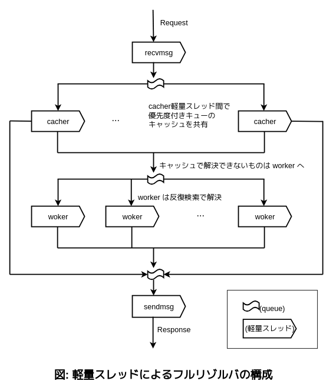
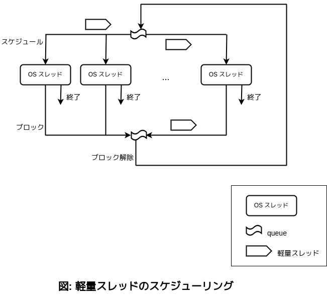
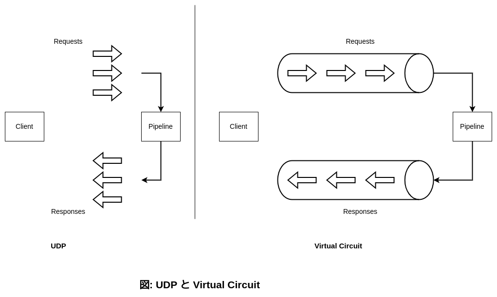
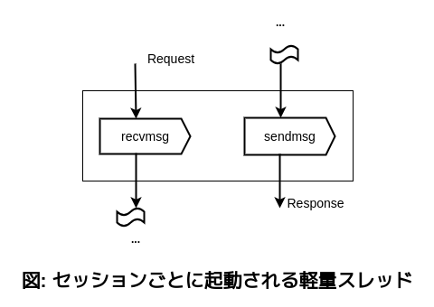
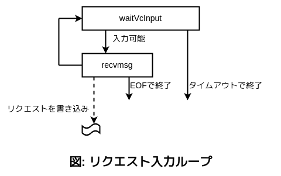
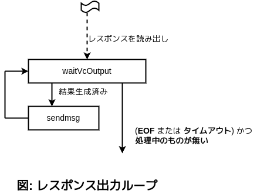

# DNSフルリゾルバ bowline の並列実行アーキテクチャ

2024.10.05

IIJ 技術研究所
日比野 啓

----

## 自己紹介

@khibino / 日比野 啓

* 以前は ISP で RADIUS 認証サーバ、認証システムの設計と開発
* 今は DNSフルリゾルバの研究開発

----

## フルリゾルバ bowline

- 機能概要
    - 反復検索/キャッシュ
    - ネガティブキャッシュ
    - DNSSEC
	- local-zone / local-data
    - UDP53/TCP53, DoT, DoH2, DoH3, DoQ
- 並列処理、セッション状態管理 ( 本日の話 )
    - 軽量スレッド (Haskell)
	- STM (Haskell)

----

## フルリゾルバ bowline の並列処理

- 軽量スレッドとキューを利用してパイプライン処理を構成する



----

## 軽量スレッドとは

- プログラミング言語処理系ランタイムで提供される軽量スレッドが、OSスレッドよりも切り替えコストが小さいことを期待している
- OS スレッドは CPU コア数程度でよい
- 軽量スレッドはコア数に縛られずに、多数、生成して良い



----

## フルリゾルバ bowline の並列処理 / 再掲

- 軽量スレッドとキューを利用してパイプライン処理を構成する
    - リクエストの受信
	- キャッシュでの解決
	- 反復検索での解決
	- レスポンスの送信


----

## デモ / bowline の軽量スレッドの一覧

- 軽量スレッドの一覧の表示
- virtual circuit のセッション用スレッドの起動

----

## Virtual Circuit

- DNS の virtual circuit
    - DNS over TCP53, DNS over TLS, DNS over HTTP, DNS over QUIC のようなセッションのあるトランスポート
    - 1つのセッション内で複数の DNS リクエストを送信してよい
	- レスポンスの順序がリクエストの順序と異なってよい



----

## bowline のセッション状態管理

- 1つのセッション内で複数の DNS リクエストを送信してよい
- レスポンスの順序がリクエストの順序と異なってよい

- セッションごとに、リクエスト入力ループとレスポンス出力の軽量スレッドを起動する



----

## bowline のセッション状態管理 / イベント列の例

- 1つの接続内で複数の DNS リクエストを送信してよい
- 結果の順序が入れ換わってよい

- イベント
    - Rn: n 番のリクエストが入力可能
    - Sn: n 番のレスポンスが出力可能
    - Eof: End of File
    - Timeout: タイムアウト


```
イベント列の例1:
R1, R2, S2, R3, Eof, S1, S3

イベント列の例2:
R1, R2, S2, Timeout, R3, S1
```

----

## bowline のセッション状態管理 / STM による入力判定

STM(Software Transactional Memory) による入力可能判定
- リクエストが入力可能あるいはタイムアウトによる終了を待つ
- タイムアウトかどうかを返す

```
waitVcInput =
  atomically
    (do  {- atomically 内が不可分に成立するまで待つ -}
      timeout <- readTVar vcTimeout  {- タイムアウトフラグ読み出し -}
      unless timeout waitInput       {- タイムアウトしていないときは、入力が来るまでやりなおす(待つ) -}
      return timeout                 {- タイムアウトフラグを結果とする -}
	)
```



- STM とは
    - トランザクションにかかわる変数の変更を待つ
    - 変数の変更の度にトランザクションを実行する
	- トランザクション内での状況が不可分に実行される

## bowline のセッション状態管理 / STM による出力判定

STM による出力可能判定
- レスポンスが出力可能あるいは終了を待つ
- 終了かどうかを返す

```
waitVcOutput =
  atomically
    (do  {- atomically 内が不可分に成立するまで待つ -}
      eof <- readTVar vcEof          {- EOF フラグ読み出し -}
      timeout <- readTVar vcTimeout  {- タイムアウトフラグ読み出し -}
      avail <- vcRespAvail           {- 結果が生成済みかどうか -}
      if eof || timeout
        then
          (if avail
	        then return False        {- レスポンスが生成済みなら終了しない(次の処理は送信) -}
            else
              (do pendings <- readTVar vcPendings   {- 処理中の集合 -}
                  unless (Set.null pendings) retry  {- 処理中の集合が空になるまでやりなおす(待つ) -}
                  return True                       {- 処理中の集合が空なら終了する -}
              )
          )
        else
          (do unless avail retry     {- レスポンスが生成されていなければやりなおす -}
              return False           {- レスポンスが生成済みなら終了しない(次の処理は送信) -}
    )
```



---

## デモ / イベント処理ごとのセッションの状態

- イベント列を順番に処理して、状態の変化を観察する
    - イベントを起こす mock を使って実行

----

## bowline セッション状態管理の検証

- ランダムテストによる、状態管理の検証
    - イベントを起こす mock を使ってテスト

- イベント
    - Rn: n 番のリクエストが入力可能
    - Sn: n 番のレスポンスが出力可能
        - n 番のリクエストが入力済みのときのみ(イベント列を生成しやすいように条件を加えている)
    - EOF: End-of-File
    - Timeout: タイムアウト
- イベント列の制約
    - Rn は Sn よりも前
    - EOF は全ての Rn よりも後
- イベント列の制約のもとでのランダム

----

## デモ / ランダムイベント列に対する終了状態と処理結果

- ランダムテスト
    - verboseCheck

----

## 備考

- bowline リポジトリ https://github.com/kazu-yamamoto/dnsext
- セッション検証ランダムテスト実装 https://github.com/kazu-yamamoto/dnsext/blob/f25cc85cab73d182ba0981ff3a62fbc889cf254f/dnsext-iterative/test/SessionPropSpec.hs
