# Opt-Out ENT!

@khibino

----

## 前置き

鈴木さんの資料 http://www.e-ontap.com/dns/onsen4/rfc5155.html に例が合わせてあります.

----

## ドメイン名の正規化順序と範囲情報によるゾーンの被覆

* 正規化順序に従って、ゾーンが NSEC/NSEC3 の範囲情報で覆われる
* ハッシュ化で順序が入れ換わる. 図の入れ換わり方は一例です
* NSEC3 ではゾーンの下界と上界のところが特殊

----

## Opt-Out による NSEC3レコード生成の省略

* gov.example. は Empty Non-Terminal (ENT) として存在するが、Opt-Out で生成を省略してもよい
* hoge.gov.example. は存在しない
* NSEC3 レコード生成が省略されていても、ゾーンが覆われる状況は変わらない

----

## 省略された ENT のサブドメインの NXDOMAIN

* `hoge.gov.example.` の NXDOMAIN を証明するには次の 3つの証拠が必要
    * `example.` のハッシュ化ドメイン名と一致するNSEC3レコード - (証明可能な)最近接名: example.
    * `*.example.` のハッシュ化ドメイン名をカバーするNSEC3レコード - (証明可能な)最近接名: example.
        * `H(*.example.).example.` は、必ず `example.` ゾーンのどこかに行き先があることに注意
    * `gov.example` をカバーするNSEC3レコード ( 次近接名: gov.example )

※ nsd がこのような結果を返さないとすれば、少なくとも RFC 通りの実装とは言えない
